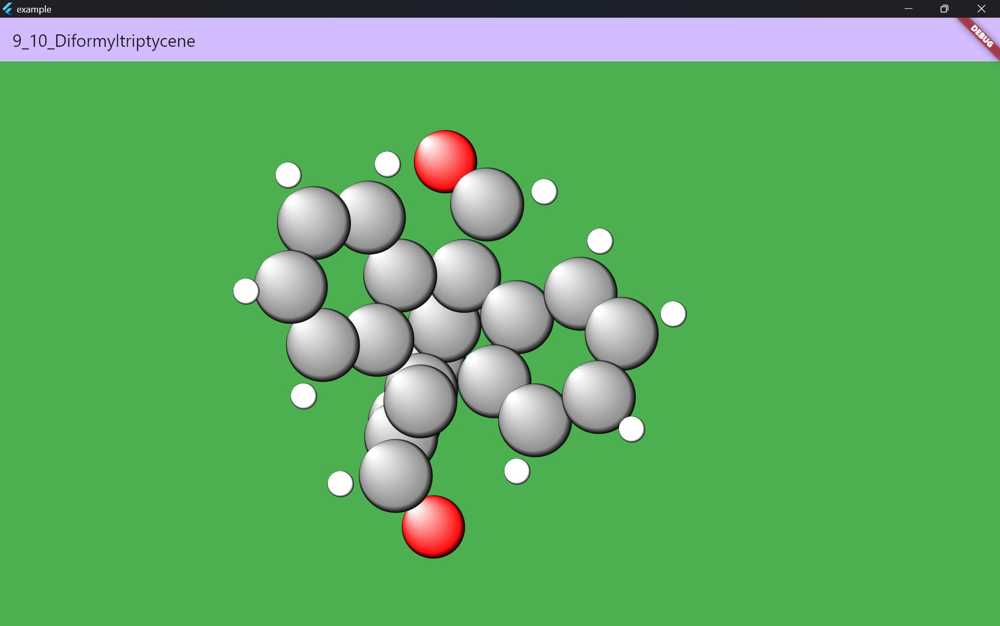
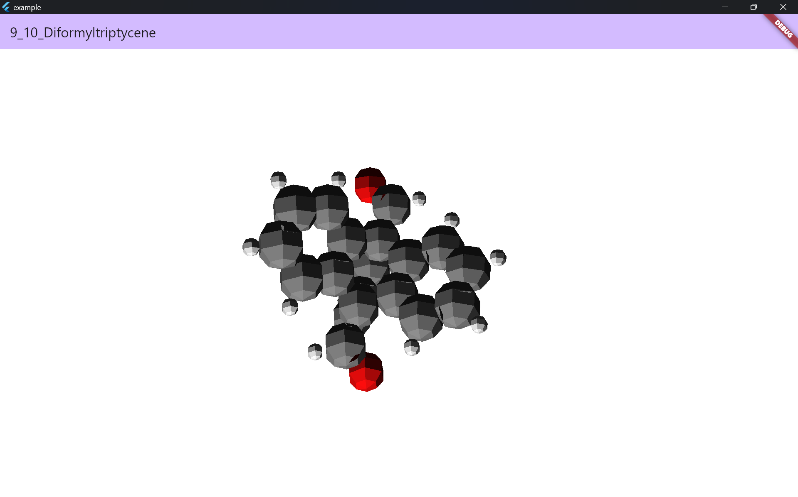

It is not finished yet.


## Features



Now, Two approaces are supported. 
1. Atoms are drawn as circles.
1. Atoms are drawn as polygons.(using ditredi) 

I think 1st approach is faster than 2nd one. (I wish it is true. I have not tested it yet.)

## Getting started

add this to your package's pubspec.yaml file:

```yaml
dependencies:
  molecular_viewer: ^0.0.1
```
            

## Usage

```dart
final xyz = """
  3
  molecule
  O 0.0 0.0 0.0
  H 0.76923944085 0.5935711586 0.0
  H -0.76923944085 0.5935711586 0.0
""";

Expanded(
    child: MolecularViewerDraggable(
        controller: controller,
        child: MolecularViewer(
            atoms: loadXyz(xyz), controller: controller)),
)
```

## Additional information

You can do any pull request or issue. I will be happy to help you.